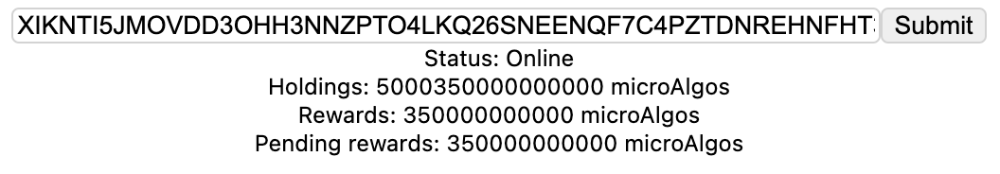

# Example for using Algonaut in a React JS app


Minimal example for using the [Rust Algorand SDK](https://github.com/manuelmauro/algonaut) in a [React](https://reactjs.org/) app.



# Instructions

Build Rust:

```
cd wasm
wasm-pack build --out-dir ../wasm-build
```

Run the React app:

```
cd react-app
yarn start
```

See more instructions for React in the [app folder](https://github.com/ivanschuetz/algonaut-react/tree/main/react-app)

Add the connection data to a running algod instance to [dependencies.rs](https://github.com/ivanschuetz/algonaut-react/blob/main/wasm/src/dependencies.rs)
